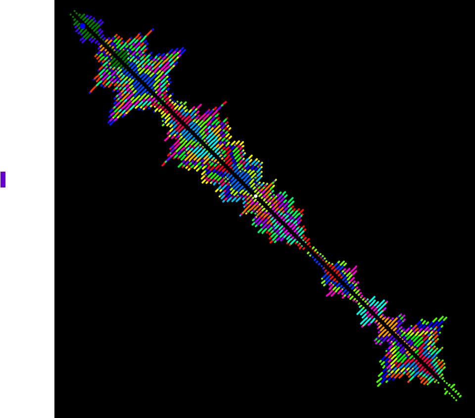
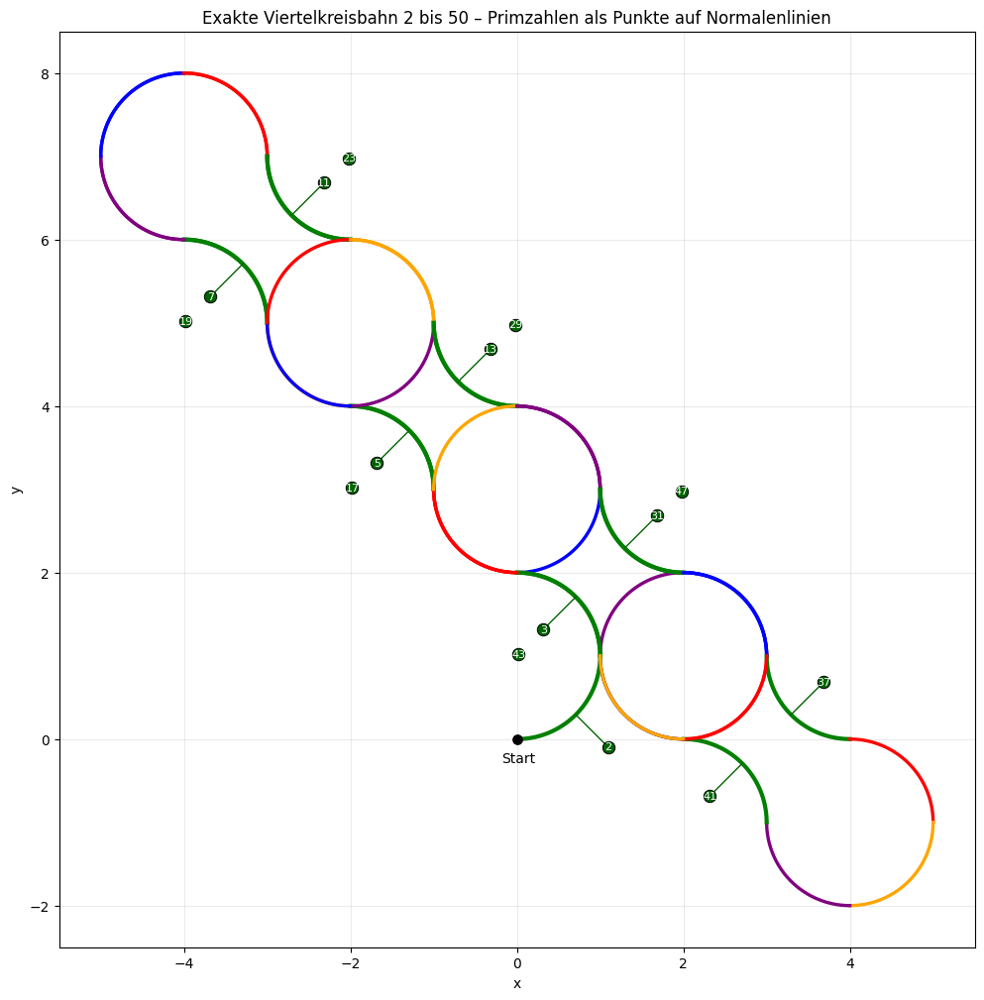
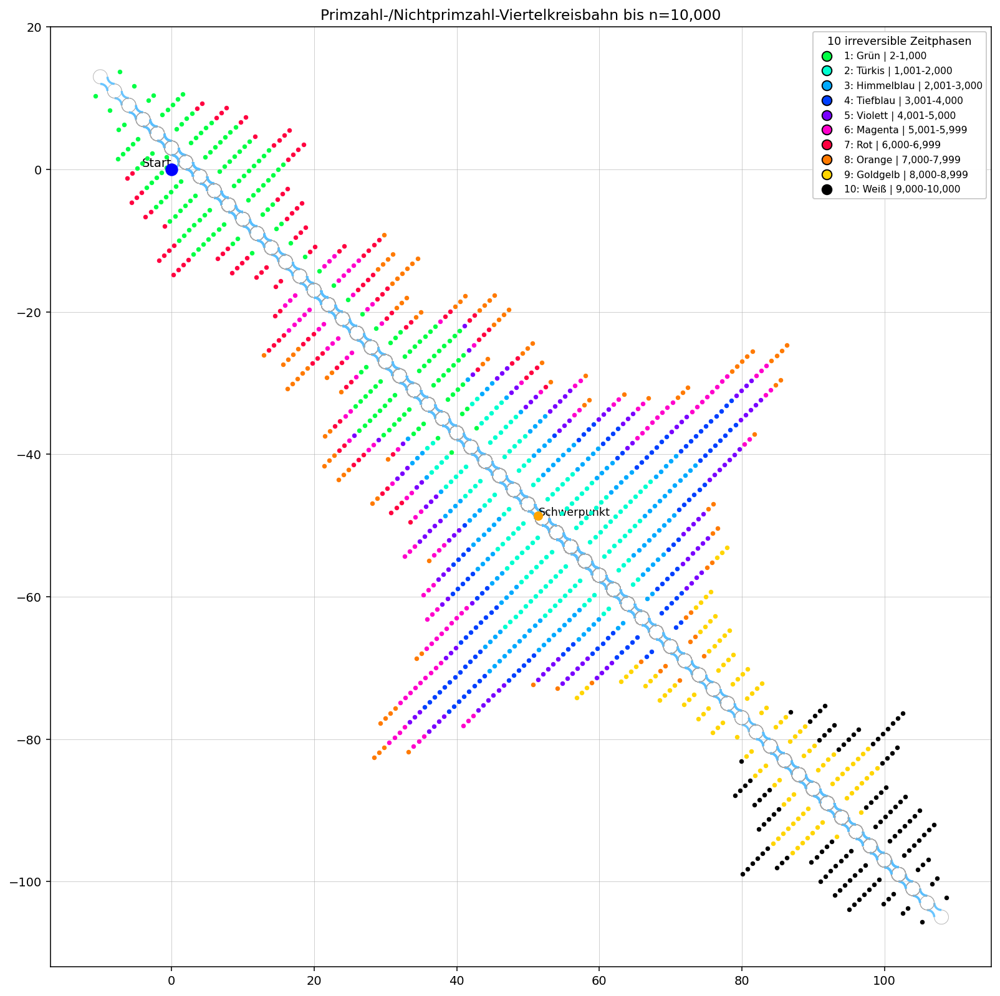
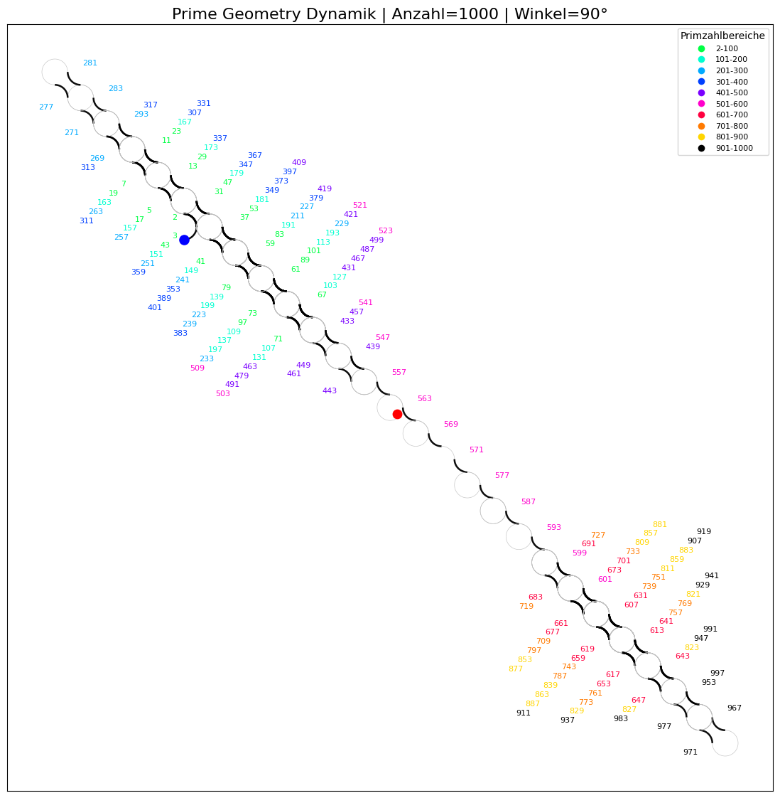
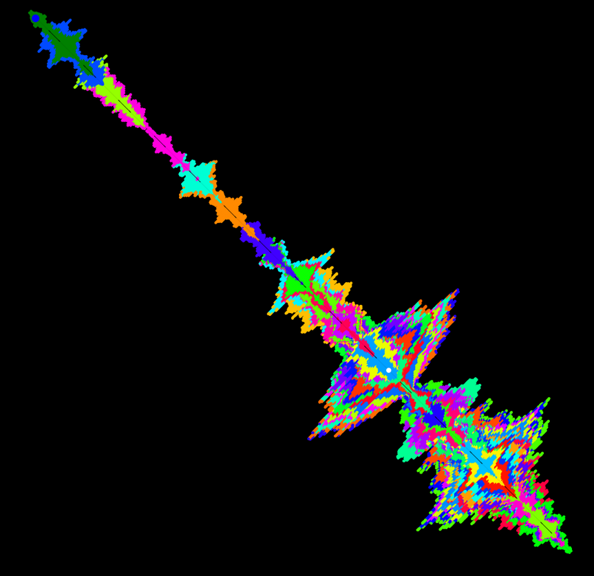
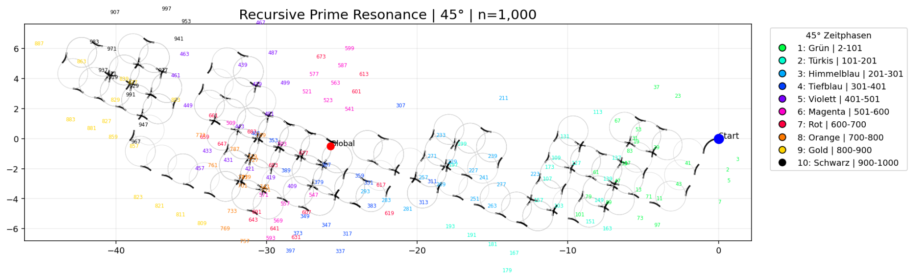
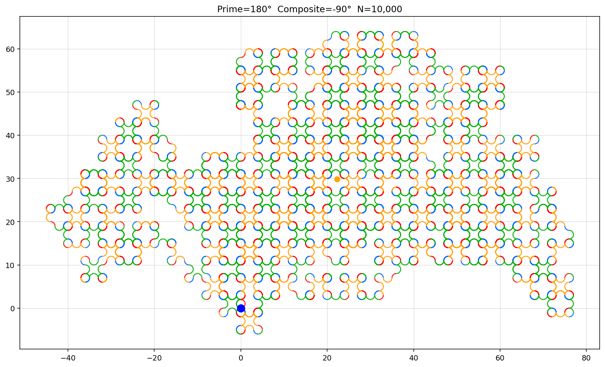
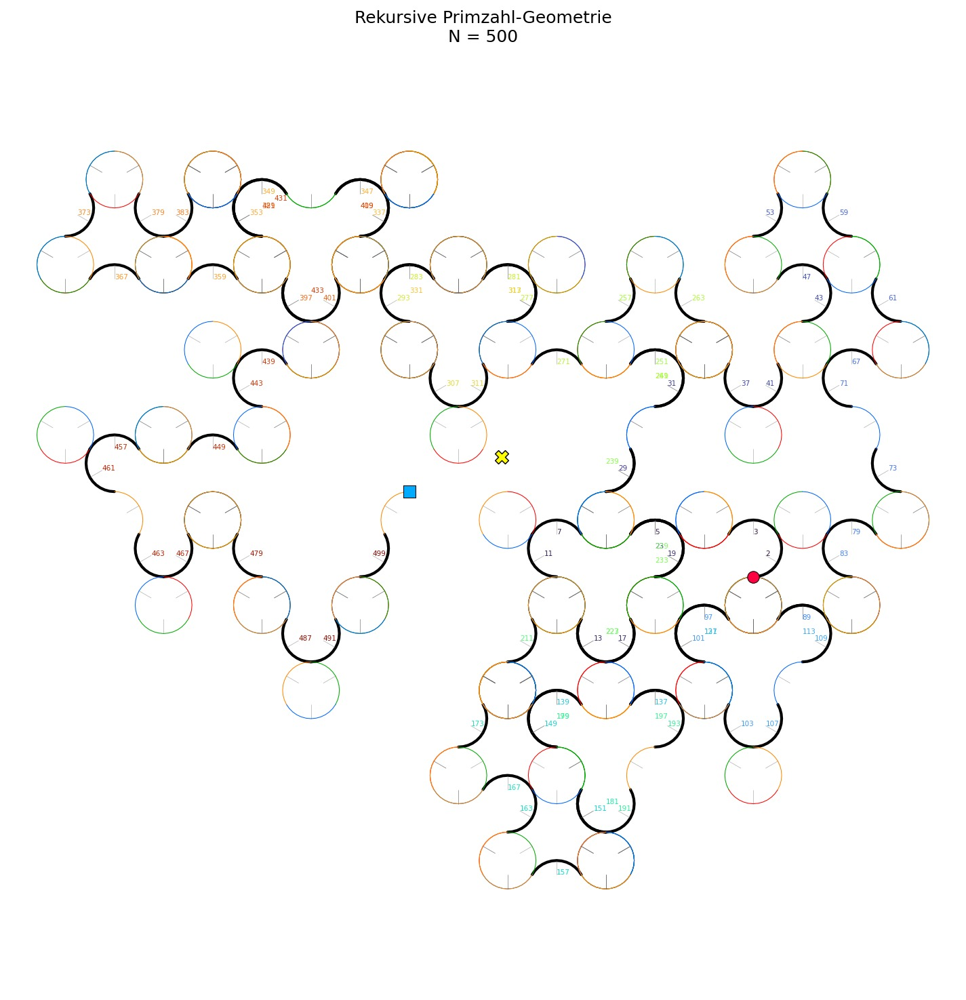
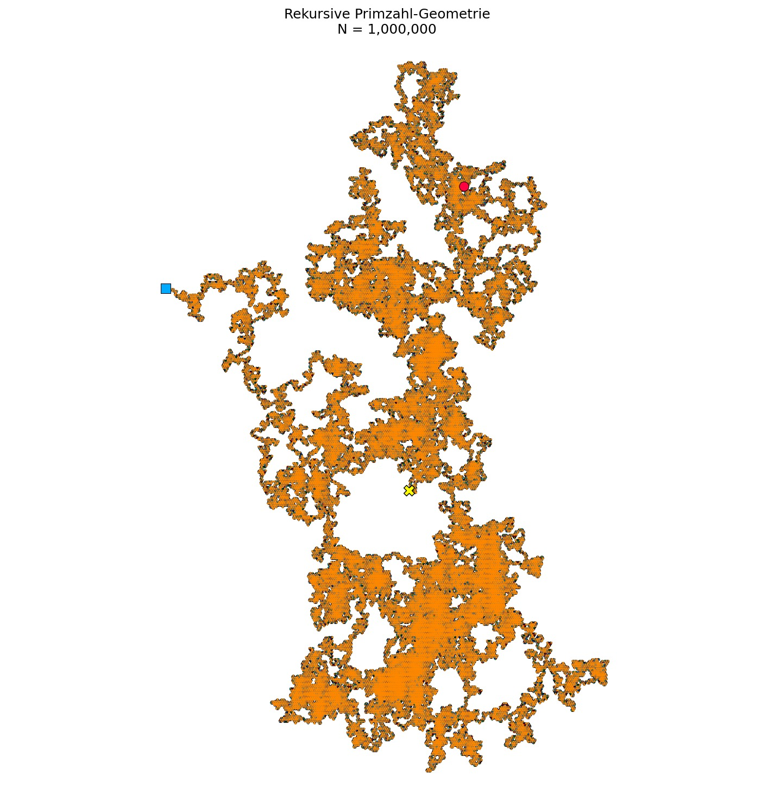

# The Prime Walk: A Geometric Exploration (Exploring Geometric Patterns Generated by Prime Numbers)

<p align="center">
  
</p>

<p align="center">

An experimental framework for visualizing geometric structures generated by deterministic prime number rules.

</p>

<p align="center">


</p>

---

# Overview

Prime Geometry is an experimental mathematical visualization framework.

Instead of plotting prime numbers on a number line, every processed integer determines how the next circular arc is generated.

The geometry evolves recursively.

Every new arc depends on the complete history of all previous prime and composite numbers.

The objective of this project is to investigate how simple arithmetic rules generate complex geometric structures.

This repository is intended as a visualization and computational research framework.

---

# Motivation

Prime numbers are traditionally studied using algebra and analytic number theory.

This project explores a different perspective.

Instead of asking

> "Where are the prime numbers?"

it asks

> "What geometric structures emerge if prime numbers control a recursive dynamical system?"

Every processed integer contributes to the evolution of one continuous geometric object.

---

# Recursive Rule

The default experiment uses

```
Prime number

    rotate +90°

Composite number

    rotate -90°
```

The framework also supports arbitrary turning angles such as

```
±1°

±45°

±90°

180° / -90°

180° / -45°

Golden Angle
```

No randomness is introduced.

The geometry is completely deterministic.

---

# Construction Algorithm

The recursive process starts at

```
Position

(0,0)
```

with an initial tangent direction.

For every processed integer

```
1. Test whether the number is prime.

2. Select the corresponding turning angle.

3. Construct the next circular arc.

4. Move to the end of the arc.

5. Update the tangent direction.

6. Repeat.
```

Each arc is connected tangentially to the previous one.

The resulting trajectory forms one continuous recursive curve.

---

# Prime Families

The software computes additional geometric information for every prime-generated arc.

Examples include

- Arc midpoint
- Arc center
- Local tangent
- Local normal
- Family index
- Resonance direction

Primes sharing similar geometric states can be grouped into geometric families.

These families are generated by the recursive construction and should not be interpreted as established mathematical classifications.

---

# Features

- Recursive circular arc geometry
- Deterministic prime/composite dynamics
- Configurable turning angles
- Efficient Sieve of Eratosthenes
- Prime family visualization
- Prime labels
- Centroid computation
- Large-scale simulations
- High-resolution image export
- MP4 video generation
- Parameterized experiments

---

# Gallery

The following figures illustrate different recursive prime geometry experiments generated by deterministic turning rules.

---

## Figure 1 — Recursive Arc Construction

<p align="center">

</p>

Illustration of the recursive quarter-circle construction and the placement of prime numbers along local normal directions.

---

## Figure 2 — Prime Geometry (±90°)

<p align="center">

</p>

Recursive geometry generated using the standard ±90° turning rule.

---

## Figure 3 — Prime Family Projection

<p align="center">

</p>

Prime numbers projected onto recursive family directions generated by the recursive construction.

---

## Figure 4 — Prime Family Resonance

<p align="center">
   
</p>

Visualization of recursively generated prime family structures.

---

## Figure 5 — Recursive Prime Geometry (45°)

<p align="center">

</p>

Prime geometry generated using a recursive 45° turning rule.

---

## Figure 6 — Recursive Prime Geometry (180° / −90°)

<p align="center">

</p>

Recursive geometry generated using a 180° rotation for prime numbers and a −90° rotation for composite numbers.

---

## Figure 7 — Connected Recursive Components (120° / −120°)

<p align="center">

</p>

Recursive geometry illustrating the emergence of connected geometric components (N = 500, using a recursive 120° turning rule).

---

## Figure 8 — Recursive Prime Geometry (N = 1,000,000, 120°)

<p align="center">

</p>

Recursive geometry after processing the first one million integers.

---

---

# Demonstration Videos

The repository also contains recorded simulations.

- [Prime Growth 90°](Video/Primzahl_Wachstum.mp4)

- [Prime Growth 90° (Pro)](Video/Primzahl_Wachstum_Pro.mp4)
  
- [Prime Growth 120° (Pro)](Primzahl_Wachstum_120Grad.mp4)
---

# Repository Structure

```
recursive-prime-geometry/

│
├── README.md
├── main.py
│
├── images/
│   ├── quarter_circle_construction.png
│   ├── prime_geometry_90deg_n1000.png
│   ├── prime_geometry_1000_number.png
│   ├── prime_family_resonance.png
│   └── Primzahl_100000_Bis_Primzahl_8000000.png
│
├── Video/
│   ├── Primzahl_Wachstum.mp4
│   └── Primzahl_Wachstum_Pro.mp4
│
└── primzahl/
    ├── arcs.py
    ├── arrays.py
    ├── constants.py
    ├── family.py
    ├── geometry.py
    ├── plotting.py
    ├── quantization.py
    ├── sieve.py
    ├── sim_statistics.py
    ├── vector_math.py
    └── ...
```

---

# Installation

Clone the repository

```bash
git clone https://github.com/SmailovicDe/recursive-prime-geometry.git

cd recursive-prime-geometry
```

Install all dependencies

```bash
pip install -r requirements.txt
```

---

# Requirements

```
Python >= 3.10

NumPy

Matplotlib

SciPy

Pillow
```

---

# Running

Example

```python
from main import prime_geometry

simulate_prime_geometry(
    N=1000,
    radius=1.0,
    rotation_angle=90.0,
    draw=True,
    ..........
)
```

The implementation also supports arbitrary turning angles and different recursive rules.

---

# Research Questions

This project investigates questions such as

- Can deterministic local arithmetic rules generate complex global geometry?

- Which structures originate from recursion itself?

- Which structures remain specific to prime numbers?

- How sensitive is the geometry to the chosen turning angle?

- Can recursive geometry be used as a fingerprint for integer sequences?

- How do different integer sequences compare geometrically?

The project is exploratory.

Visible patterns should be considered computational observations rather than mathematical proofs.

---

# Current Experiments

Examples include

```
Prime      → +90°
Composite  → -90°
```

```
Prime      → +180°
Composite  → -90°
```

```
Prime      → +45°
Composite  → -45°
```

```
Prime      → +120°
Composite  → -120°
```

```
Golden Angle experiments
```

---

# Performance

The framework supports simulations ranging from a few hundred integers to many millions of processed values depending on available hardware.

Performance optimizations include

- Vectorized NumPy arrays
- Efficient prime sieve
- Configurable sampling density
- Optional rendering
- Large-scale image generation

---

# Disclaimer

This repository does **not** claim

- a new primality test,

- a proof concerning prime distribution,

- a proof of hidden prime resonances,

- or a new mathematical theorem.

The project provides a reproducible computational environment for exploring recursive geometric representations of integer sequences.

---

# Contributing

Contributions are welcome.

Areas of interest include

- Algorithm optimization

- Visualization

- Mathematical analysis

- Statistical evaluation

- Documentation

Please open an issue before proposing major structural changes.

---

# Citation

If this software contributes to academic work, please cite this repository.

Future releases may include a `CITATION.cff` file.

---

# License

Released under the MIT License.

---

# Author

**Errachdi & Akenkou**

GitHub:

https://github.com/IZKNakhil
